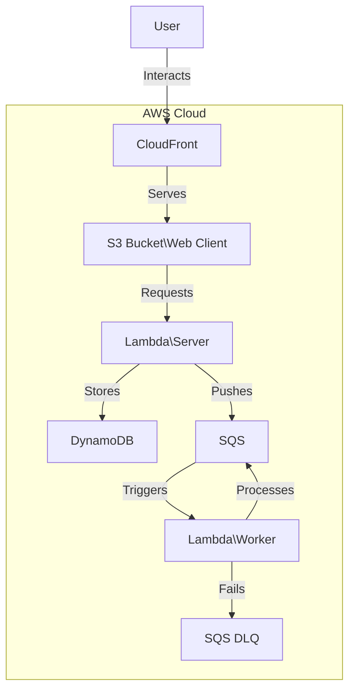
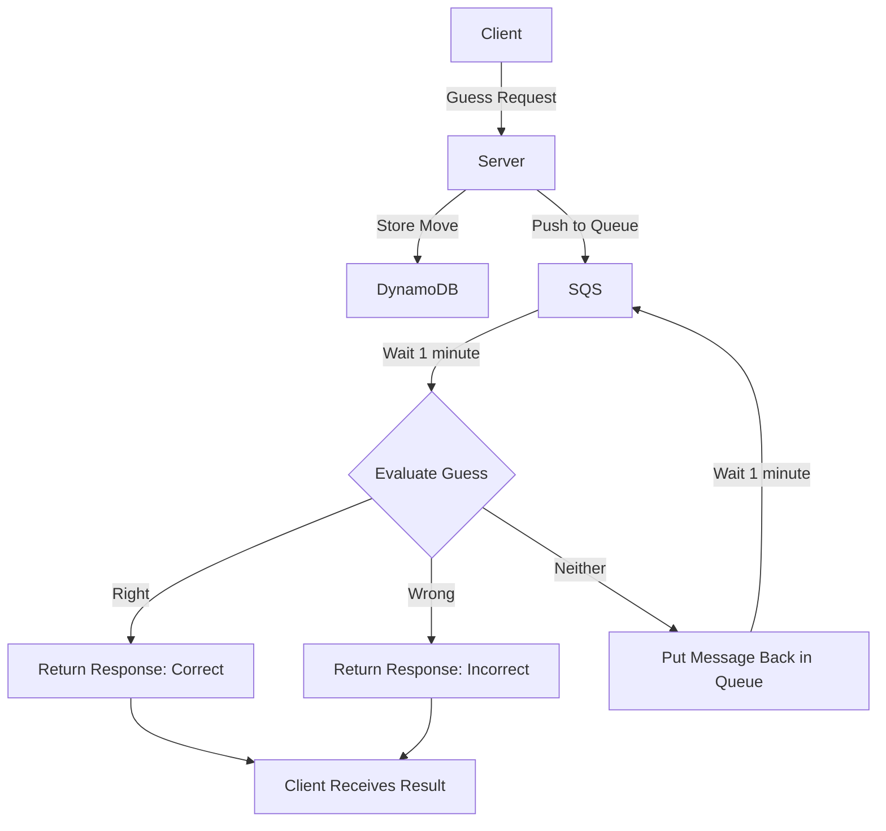

# Welcome to Katano!

Katano is a simple guessing game built with [Remix](https://remix.run/) and uses [SST](https://sst.dev) to manage its infrastructure deployed to AWS.

You can preview it [here](https://d32ar85gncb67v.cloudfront.net/).

## Architecture

### Deployment



### Logic



## Getting Started

Getting started is easy, just follow the steps below:

1. Make sure you have your AWS credentials configured
2. Clone the repo to your desired location
3. Install the dependencies(the project uses bun, feel free to use your preferred package manager)

```shellscript
bun install
```

### Environment Variables

We've fully embraced the no .env file approach here, so to set your env variables we use the [SST secrets component](https://sst.dev/docs/component/secret/). We only have one secret, the session secret, which is used to encrypt the session cookie. You can generate a random secret by running the following command:

```shellscript
 openssl rand -hex 32
```

And then set it via the cli:

```shellscript
 AWS_PROFILE=your-profile-name bunx sst secrets set SessionSecret your-secret-value
```

4. Run the dev command, this should setup everything you need to get started
   including the infrastructure for development

```shellscript
AWS_PROFILE=your-profile-name bunx sst dev
```

## Deployment

Deploying the app is as simple as running one command:

```shellscript
AWS_PROFILE=your-profile-name bunx sst deploy --stage=your-stage-name
```

> Note: Before deploying make sure to set your secrets to the stage you are deploying to.
